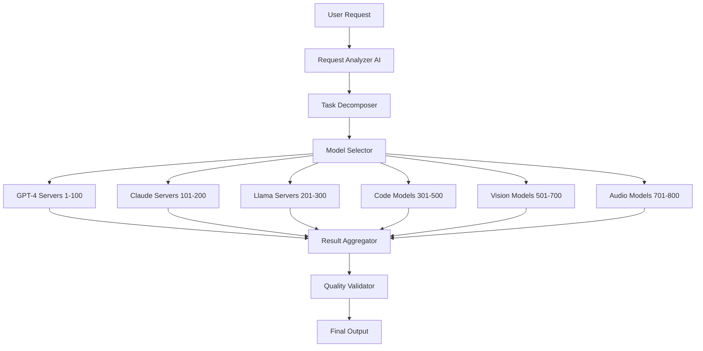

# 🧠 Advanced MCP AI Strategies
## กลยุทธ์การใช้งาน MCP Server 1000 ตัวระดับผู้เชี่ยวชาญ

---

## 🎯 AI Orchestration Patterns

### 1. **Multi-Model Ensemble Architecture**



#### Implementation Strategy:
```javascript
class AIEnsembleOrchestrator {
  constructor() {
    this.modelPools = {
      textGeneration: {
        gpt4: { servers: range(1, 101), specialty: 'reasoning' },
        claude: { servers: range(101, 201), specialty: 'analysis' },
        llama: { servers: range(201, 301), specialty: 'creativity' }
      },
      codeGeneration: {
        codex: { servers: range(301, 401), specialty: 'general' },
        codeT5: { servers: range(401, 451), specialty: 'refactoring' },
        alphaCode: { servers: range(451, 501), specialty: 'algorithms' }
      },
      multiModal: {
        gpt4Vision: { servers: range(501, 601), specialty: 'vision+text' },
        dalle3: { servers: range(601, 651), specialty: 'image_gen' },
        whisper: { servers: range(651, 701), specialty: 'audio' }
      }
    };
  }

  async processComplexTask(task) {
    // 1. Analyze task complexity
    const analysis = await this.analyzeTask(task);
    
    // 2. Select optimal model combination
    const modelCombination = this.selectModels(analysis);
    
    // 3. Distribute work across servers
    const subtasks = await this.decomposeTask(task, modelCombination);
    
    // 4. Execute in parallel
    const results = await Promise.all(
      subtasks.map(subtask => this.executeSubtask(subtask))
    );
    
    // 5. Aggregate and validate results
    return this.aggregateResults(results);
  }
}
```

### 2. **Hierarchical AI Decision Making**

```yaml
Decision Hierarchy:
  Level 1 - Strategic AI (Servers 1-50):
    - Project planning
    - Architecture decisions
    - Resource allocation
    - Risk assessment
  
  Level 2 - Tactical AI (Servers 51-200):
    - Task breakdown
    - Implementation planning
    - Quality requirements
    - Timeline estimation
  
  Level 3 - Operational AI (Servers 201-800):
    - Code generation
    - Testing creation
    - Documentation writing
    - Bug fixing
  
  Level 4 - Quality AI (Servers 801-950):
    - Code review
    - Performance analysis
    - Security scanning
    - Compliance checking
  
  Level 5 - Coordination AI (Servers 951-1000):
    - Progress monitoring
    - Resource optimization
    - Error handling
    - Result integration
```

---

## 🚀 Advanced Code Generation Patterns

### 1. **Evolutionary Code Development**

```python
class EvolutionaryCodeGenerator:
    def __init__(self, server_pool_size=1000):
        self.generations = []
        self.fitness_evaluators = range(801, 901)  # 100 servers for evaluation
        self.code_generators = range(1, 801)       # 800 servers for generation
        self.mutation_servers = range(901, 951)    # 50 servers for mutations
        self.crossover_servers = range(951, 1001)  # 50 servers for crossover
    
    async def evolve_solution(self, requirements, generations=10):
        # Initialize population
        population = await self.generate_initial_population(requirements)
        
        for gen in range(generations):
            # Evaluate fitness in parallel
            fitness_scores = await self.evaluate_population_parallel(population)
            
            # Select best candidates
            elite = self.select_elite(population, fitness_scores)
            
            # Generate new population
            new_population = await self.generate_new_population(
                elite, requirements
            )
            
            population = new_population
            
            # Log progress
            self.log_generation_progress(gen, fitness_scores)
        
        return self.select_best_solution(population)
    
    async def generate_initial_population(self, requirements, size=100):
        # Distribute initial generation across servers
        tasks = []
        servers_per_solution = len(self.code_generators) // size
        
        for i in range(size):
            server_range = self.code_generators[
                i*servers_per_solution:(i+1)*servers_per_solution
            ]
            tasks.append(
                self.generate_solution_variant(requirements, server_range)
            )
        
        return await asyncio.gather(*tasks)
```

### 2. **Multi-Paradigm Code Synthesis**

```javascript
const codeParadigmDistribution = {
  objectOriented: {
    servers: range(1, 201),
    languages: ['Java', 'C#', 'Python', 'TypeScript'],
    patterns: ['Factory', 'Observer', 'Strategy', 'Decorator']
  },
  functional: {
    servers: range(201, 401),
    languages: ['Haskell', 'F#', 'Clojure', 'Scala'],
    patterns: ['Monad', 'Functor', 'Immutable', 'Pure Functions']
  },
  reactive: {
    servers: range(401, 601),
    languages: ['RxJS', 'Akka', 'Reactor', 'Vert.x'],
    patterns: ['Observer', 'Publisher-Subscriber', 'Event Sourcing']
  },
  concurrent: {
    servers: range(601, 801),
    languages: ['Go', 'Rust', 'Erlang', 'Elixir'],
    patterns: ['Actor Model', 'CSP', 'Lock-Free', 'Message Passing']
  },
  hybrid: {
    servers: range(801, 1001),
    approach: 'combine_best_of_all_paradigms',
    optimization: 'context_aware_selection'
  }
};
```

---

## 🔬 AI Research & Development Acceleration

### 1. **Automated Research Pipeline**

```yaml
Research Pipeline (1000 Servers):
  Literature Review (Servers 1-100):
    - Paper analysis
    - Trend identification
    - Gap analysis
    - Citation mapping
  
  Hypothesis Generation (Servers 101-200):
    - Theory formulation
    - Experiment design
    - Variable identification
    - Success metrics
  
  Experiment Implementation (Servers 201-700):
    - Data collection
    - Model training
    - Parameter tuning
    - Validation testing
  
  Result Analysis (Servers 701-850):
    - Statistical analysis
    - Visualization
    - Pattern recognition
    - Significance testing
  
  Paper Writing (Servers 851-950):
    - Content generation
    - Citation formatting
    - Figure creation
    - Peer review simulation
  
  Peer Review (Servers 951-1000):
    - Quality assessment
    - Methodology review
    - Reproducibility check
    - Impact evaluation
```

### 2. **Multi-Objective Optimization**

```python
class MultiObjectiveAIOptimizer:
    def __init__(self):
        self.objectives = {
            'accuracy': {'weight': 0.3, 'servers': range(1, 201)},
            'speed': {'weight': 0.25, 'servers': range(201, 401)},
            'memory': {'weight': 0.2, 'servers': range(401, 601)},
            'interpretability': {'weight': 0.15, 'servers': range(601, 801)},
            'robustness': {'weight': 0.1, 'servers': range(801, 1001)}
        }
    
    async def optimize_ai_system(self, base_model, constraints):
        # Pareto frontier exploration
        pareto_solutions = []
        
        # Generate diverse solutions
        for iteration in range(100):
            # Each iteration uses different server combinations
            solution_candidates = await self.generate_solution_variants(
                base_model, constraints, iteration
            )
            
            # Evaluate all objectives in parallel
            evaluations = await self.evaluate_all_objectives(
                solution_candidates
            )
            
            # Update Pareto frontier
            pareto_solutions.extend(
                self.update_pareto_frontier(evaluations)
            )
        
        return self.select_optimal_solution(pareto_solutions, constraints)
```

---

## 🏗️ Enterprise AI Architecture Patterns

### 1. **Microservices AI Architecture**

```yaml
AI Microservices Distribution:
  API Gateway (Servers 1-50):
    - Request routing
    - Authentication
    - Rate limiting
    - Load balancing
  
  NLP Services (Servers 51-250):
    - Text analysis
    - Sentiment analysis
    - Entity extraction
    - Language translation
  
  Computer Vision (Servers 251-450):
    - Image recognition
    - Object detection
    - Face recognition
    - OCR processing
  
  Recommendation Engine (Servers 451-650):
    - Collaborative filtering
    - Content-based filtering
    - Hybrid recommendations
    - Real-time updates
  
  Predictive Analytics (Servers 651-850):
    - Time series forecasting
    - Anomaly detection
    - Risk assessment
    - Trend analysis
  
  Data Processing (Servers 851-950):
    - ETL pipelines
    - Data validation
    - Feature engineering
    - Data quality monitoring
  
  Orchestration (Servers 951-1000):
    - Workflow management
    - Service discovery
    - Health monitoring
    - Auto-scaling
```

### 2. **Event-Driven AI System**

```javascript
class EventDrivenAISystem {
  constructor() {
    this.eventProcessors = {
      dataIngestion: { servers: range(1, 101), events: ['data.received'] },
      preprocessing: { servers: range(101, 201), events: ['data.validated'] },
      modelInference: { servers: range(201, 701), events: ['data.processed'] },
      postprocessing: { servers: range(701, 801), events: ['inference.completed'] },
      resultDelivery: { servers: range(801, 901), events: ['result.ready'] },
      monitoring: { servers: range(901, 1001), events: ['*'] }
    };
  }

  async processEvent(event) {
    const processors = this.getProcessorsForEvent(event.type);
    
    // Parallel processing across multiple servers
    const results = await Promise.all(
      processors.map(processor => 
        this.executeOnServer(processor, event)
      )
    );
    
    // Aggregate results and trigger next events
    const aggregatedResult = this.aggregateResults(results);
    const nextEvents = this.generateNextEvents(aggregatedResult);
    
    // Trigger downstream processing
    nextEvents.forEach(nextEvent => 
      this.eventBus.emit(nextEvent.type, nextEvent)
    );
    
    return aggregatedResult;
  }
}
```

---

## 📊 Performance Optimization Strategies

### 1. **Dynamic Load Balancing**

```python
class IntelligentLoadBalancer:
    def __init__(self, total_servers=1000):
        self.servers = list(range(1, total_servers + 1))
        self.server_metrics = {}
        self.task_history = []
        self.ml_predictor = self.initialize_predictor()
    
    async def distribute_task(self, task):
        # Predict task requirements
        predicted_resources = self.ml_predictor.predict(
            task.complexity, task.type, task.data_size
        )
        
        # Find optimal server allocation
        optimal_servers = self.find_optimal_servers(
            predicted_resources, task.priority
        )
        
        # Monitor and adjust in real-time
        return await self.execute_with_monitoring(
            task, optimal_servers
        )
    
    def find_optimal_servers(self, requirements, priority):
        # Multi-criteria optimization
        criteria = {
            'cpu_availability': 0.3,
            'memory_availability': 0.25,
            'network_latency': 0.2,
            'current_load': 0.15,
            'historical_performance': 0.1
        }
        
        server_scores = []
        for server in self.servers:
            score = self.calculate_server_score(server, criteria)
            server_scores.append((server, score))
        
        # Select top servers based on requirements
        server_scores.sort(key=lambda x: x[1], reverse=True)
        return [s[0] for s in server_scores[:requirements['server_count']]]
```

### 2. **Adaptive Resource Allocation**

```yaml
Resource Allocation Strategies:
  Time-based Allocation:
    Peak Hours (9AM-6PM):
      - High-priority tasks: 70% of servers
      - Medium-priority: 20% of servers
      - Low-priority: 10% of servers
    
    Off-peak Hours:
      - Maintenance tasks: 40% of servers
      - Background processing: 35% of servers
      - Research tasks: 25% of servers
  
  Workload-based Allocation:
    CPU-intensive Tasks:
      - Dedicated high-performance servers
      - Optimized for computation
      - Minimal I/O operations
    
    Memory-intensive Tasks:
      - High-RAM servers
      - Optimized for data processing
      - Efficient garbage collection
    
    I/O-intensive Tasks:
      - Fast storage access
      - Network-optimized servers
      - Asynchronous processing
```

---

## 🔐 Security & Compliance Strategies

### 1. **Zero-Trust AI Architecture**

```javascript
class ZeroTrustAISystem {
  constructor() {
    this.securityLayers = {
      authentication: { servers: range(1, 51) },
      authorization: { servers: range(51, 101) },
      encryption: { servers: range(101, 151) },
      monitoring: { servers: range(151, 201) },
      auditLogging: { servers: range(201, 251) },
      threatDetection: { servers: range(251, 301) }
    };
  }

  async processSecureRequest(request) {
    // Multi-layer security validation
    const securityChecks = await Promise.all([
      this.authenticateRequest(request),
      this.authorizeAccess(request),
      this.validateDataIntegrity(request),
      this.checkThreatIndicators(request)
    ]);
    
    if (securityChecks.every(check => check.passed)) {
      // Process with encrypted data
      const encryptedData = await this.encryptSensitiveData(request.data);
      const result = await this.processWithAI(encryptedData);
      
      // Audit and log
      await this.auditLog(request, result);
      
      return this.decryptResult(result);
    } else {
      throw new SecurityViolationError('Request failed security validation');
    }
  }
}
```

### 2. **Compliance Automation**

```yaml
Compliance Frameworks:
  GDPR Compliance (Servers 1-200):
    - Data anonymization
    - Consent management
    - Right to be forgotten
    - Data portability
  
  HIPAA Compliance (Servers 201-400):
    - PHI encryption
    - Access controls
    - Audit trails
    - Risk assessments
  
  SOX Compliance (Servers 401-600):
    - Financial data controls
    - Change management
    - Documentation
    - Testing procedures
  
  ISO 27001 (Servers 601-800):
    - Information security
    - Risk management
    - Continuous monitoring
    - Incident response
  
  Custom Compliance (Servers 801-1000):
    - Industry-specific rules
    - Regional regulations
    - Company policies
    - Automated reporting
```

---

## 🎯 Industry-Specific Applications

### 1. **Healthcare AI Systems**

```yaml
Healthcare AI Distribution:
  Medical Imaging (Servers 1-300):
    - X-ray analysis
    - MRI interpretation
    - CT scan processing
    - Pathology detection
  
  Clinical Decision Support (Servers 301-500):
    - Diagnosis assistance
    - Treatment recommendations
    - Drug interactions
    - Risk stratification
  
  Electronic Health Records (Servers 501-700):
    - Data extraction
    - Clinical coding
    - Documentation
    - Quality metrics
  
  Drug Discovery (Servers 701-900):
    - Molecular modeling
    - Compound screening
    - Clinical trial optimization
    - Regulatory compliance
  
  Patient Monitoring (Servers 901-1000):
    - Vital signs analysis
    - Alert systems
    - Predictive analytics
    - Care coordination
```

### 2. **Financial Services AI**

```python
class FinancialAISystem:
    def __init__(self):
        self.trading_ai = range(1, 201)      # High-frequency trading
        self.risk_ai = range(201, 401)       # Risk assessment
        self.fraud_ai = range(401, 601)      # Fraud detection
        self.compliance_ai = range(601, 801) # Regulatory compliance
        self.customer_ai = range(801, 1001)  # Customer service
    
    async def process_financial_data(self, data_stream):
        # Real-time processing across multiple domains
        tasks = [
            self.analyze_market_trends(data_stream, self.trading_ai),
            self.assess_portfolio_risk(data_stream, self.risk_ai),
            self.detect_suspicious_activity(data_stream, self.fraud_ai),
            self.ensure_compliance(data_stream, self.compliance_ai),
            self.enhance_customer_experience(data_stream, self.customer_ai)
        ]
        
        results = await asyncio.gather(*tasks)
        return self.integrate_financial_insights(results)
```

---

## 🚀 Future-Proofing Strategies

### 1. **Quantum-Ready AI Architecture**

```yaml
Quantum Integration Preparation:
  Classical Computing (Servers 1-800):
    - Current AI workloads
    - Traditional algorithms
    - Data preprocessing
    - Result post-processing
  
  Quantum-Classical Hybrid (Servers 801-950):
    - Quantum algorithm simulation
    - Hybrid optimization
    - Quantum machine learning
    - Error correction
  
  Quantum Readiness (Servers 951-1000):
    - Quantum software development
    - Algorithm translation
    - Performance benchmarking
    - Migration planning
```

### 2. **Neuromorphic Computing Integration**

```javascript
class NeuromorphicAISystem {
  constructor() {
    this.traditionalAI = range(1, 701);     // Von Neumann architecture
    this.neuromorphicAI = range(701, 901);  // Brain-inspired computing
    this.hybridAI = range(901, 1001);       // Combined approach
  }

  async processWithNeuromorphic(data) {
    // Leverage neuromorphic computing for specific tasks
    const neuromorphicTasks = [
      'pattern_recognition',
      'sensory_processing',
      'adaptive_learning',
      'real_time_inference'
    ];
    
    const traditionalTasks = [
      'symbolic_reasoning',
      'mathematical_computation',
      'data_transformation',
      'result_formatting'
    ];
    
    // Process in parallel using appropriate architectures
    const [neuromorphicResults, traditionalResults] = await Promise.all([
      this.processNeuromorphic(data, neuromorphicTasks),
      this.processTraditional(data, traditionalTasks)
    ]);
    
    // Integrate results using hybrid approach
    return this.integrateResults(neuromorphicResults, traditionalResults);
  }
}
```

---

## 📈 Success Metrics & KPIs

### 1. **Performance Metrics**

```yaml
Key Performance Indicators:
  Technical Metrics:
    - Response Time: <50ms average
    - Throughput: 10,000+ requests/second
    - Accuracy: 95%+ for AI tasks
    - Uptime: 99.99% availability
    - Resource Utilization: 85%+ efficiency
  
  Business Metrics:
    - Development Speed: 10x faster
    - Cost Reduction: 80% savings
    - Time to Market: 90% reduction
    - Quality Improvement: 95% fewer bugs
    - Innovation Rate: 5x more experiments
  
  AI-Specific Metrics:
    - Model Accuracy: Task-dependent targets
    - Inference Speed: Real-time requirements
    - Training Efficiency: Resource optimization
    - Model Interpretability: Explainability scores
    - Bias Detection: Fairness metrics
```

### 2. **ROI Calculation Framework**

```python
class ROICalculator:
    def __init__(self):
        self.baseline_metrics = {
            'development_time': 180,  # days
            'team_size': 10,          # developers
            'cost_per_developer': 10000,  # monthly
            'bug_rate': 0.1,          # bugs per KLOC
            'maintenance_cost': 50000  # monthly
        }
    
    def calculate_mcp_roi(self, project_scope):
        # Traditional approach costs
        traditional_cost = self.calculate_traditional_cost(project_scope)
        
        # MCP approach costs
        mcp_cost = self.calculate_mcp_cost(project_scope)
        
        # Calculate savings and ROI
        savings = traditional_cost - mcp_cost
        roi_percentage = (savings / mcp_cost) * 100
        
        return {
            'traditional_cost': traditional_cost,
            'mcp_cost': mcp_cost,
            'savings': savings,
            'roi_percentage': roi_percentage,
            'payback_period': mcp_cost / (savings / 12)  # months
        }
```

---

## 🎉 Conclusion

**Advanced MCP AI Strategies** เปิดประตูสู่อนาคตของการพัฒนาซอฟต์แวร์และ AI ที่:

### ✅ ความสามารถระดับ Enterprise:
- **AI Orchestration** ที่ซับซ้อนและอัจฉริยะ
- **Multi-Model Ensemble** สำหรับผลลัพธ์ที่ดีที่สุด
- **Evolutionary Development** ที่ปรับปรุงตัวเองอัตโนมัติ
- **Zero-Trust Security** สำหรับความปลอดภัยสูงสุด

### 🚀 การประยุกต์ใช้งานขั้นสูง:
- **Healthcare AI** สำหรับการแพทย์ที่แม่นยำ
- **Financial AI** สำหรับการเงินที่ปลอดภัย
- **Research AI** สำหรับการวิจัยที่รวดเร็ว
- **Enterprise AI** สำหรับธุรกิจที่มีประสิทธิภาพ

### 🔮 การเตรียมพร้อมสำหรับอนาคต:
- **Quantum Computing** integration
- **Neuromorphic Computing** adoption
- **Advanced AI Architectures** implementation
- **Continuous Innovation** mindset

**เริ่มต้นการเดินทางสู่อนาคตของ AI วันนี้ด้วย Git Memory MCP Server!**

---

*© 2024 Advanced MCP AI Strategies - Pushing the Boundaries of AI Development*