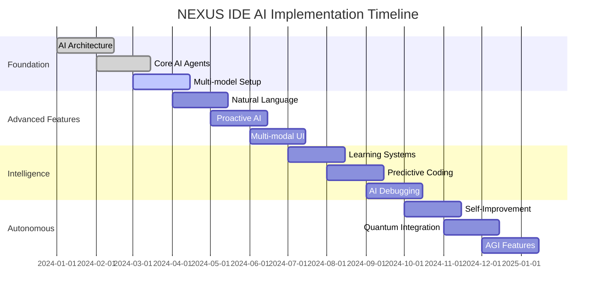

# 🚀 NEXUS IDE - Product Requirements Document (PRD)

## 📋 Executive Summary

**NEXUS IDE** เป็น Next-Generation Integrated Development Environment ที่ออกแบบมาเพื่อเป็น "Ultimate IDE" ที่รวมเอาจุดแข็งของ IDE ชั้นนำทั้งหมดมาไว้ในที่เดียว โดยใช้ Git Memory MCP Server เป็นแกนหลักในการเชื่อมต่อและจัดการข้อมูลจากแหล่งต่างๆ พร้อมด้วยระบบ AI ที่ทรงพลังและการทำงานร่วมกันแบบ real-time

### 🎯 วิสัยทัศน์
- **AI-Native IDE**: IDE ที่ AI เป็นหัวใจหลักในทุกฟีเจอร์และการทำงาน
- **Universal Connectivity**: เชื่อมต่อได้กับทุกแหล่งข้อมูล เครื่องมือ และบริการ
- **Zero-Friction Development**: ลดความซับซ้อนในการพัฒนาให้เหลือน้อยที่สุด
- **Collaborative by Design**: สร้างมาเพื่อการทำงานร่วมกันแบบ seamless
- **Performance-First**: ประสิทธิภาพสูงสุดในทุกการทำงาน

---

## 🎯 Product Vision & Goals

### Primary Goals
1. **สร้าง IDE ที่เหนือกว่าทุก IDE ที่มีอยู่ในตลาด**
2. **ให้ AI เป็นผู้ช่วยที่ฉลาดและเข้าใจ context ได้อย่างลึกซึ้ง**
3. **เชื่อมต่อทุกแหล่งข้อมูลและเครื่องมือในระบบเดียว**
4. **สร้างประสบการณ์การพัฒนาที่ราบรื่นและมีประสิทธิภาพสูงสุด**
5. **รองรับการทำงานร่วมกันแบบ real-time อย่างสมบูรณ์**

### Success Metrics
- **Developer Productivity**: เพิ่มประสิทธิภาพการพัฒนา 300%
- **Code Quality**: ลด bugs และ security vulnerabilities 80%
- **Learning Curve**: ลดเวลาการเรียนรู้เครื่องมือใหม่ 70%
- **Collaboration Efficiency**: เพิ่มประสิทธิภาพการทำงานร่วมกัน 250%
- **User Satisfaction**: NPS Score > 80

---

## 🏗️ System Architecture

### High-Level Architecture
```
┌─────────────────────────────────────────────────────────────────┐
│                      NEXUS IDE Frontend                         │
│  ┌─────────────┐ ┌─────────────┐ ┌─────────────────────────┐   │
│  │   Monaco    │ │  Smart File │ │      AI Copilot         │   │
│  │   Editor+   │ │   Explorer  │ │      Assistant          │   │
│  └─────────────┘ └─────────────┘ └─────────────────────────┘   │
│  ┌─────────────┐ ┌─────────────┐ ┌─────────────────────────┐   │
│  │ Integrated  │ │ Multi-Debug │ │   Real-time Collab      │   │
│  │  Terminal+  │ │   Panel     │ │      Hub                │   │
│  └─────────────┘ └─────────────┘ └─────────────────────────┘   │
│  ┌─────────────┐ ┌─────────────┐ ┌─────────────────────────┐   │
│  │   Plugin    │ │  Performance│ │    Visual Programming   │   │
│  │  Ecosystem  │ │   Monitor   │ │       Interface         │   │
│  └─────────────┘ └─────────────┘ └─────────────────────────┘   │
└─────────────────────────────────────────────────────────────────┘
                              │
                              ▼
┌─────────────────────────────────────────────────────────────────┐
│                 Advanced MCP Communication Layer                │
│  ┌─────────────┐ ┌─────────────┐ ┌─────────────────────────┐   │
│  │ WebSocket   │ │   GraphQL   │ │      gRPC               │   │
│  │ Real-time   │ │   Gateway   │ │   High-Performance      │   │
│  └─────────────┘ └─────────────┘ └─────────────────────────┘   │
│  ┌─────────────┐ ┌─────────────┐ ┌─────────────────────────┐   │
│  │   REST API  │ │  Event Bus  │ │    Message Queue        │   │
│  │   Gateway   │ │   System    │ │      System             │   │
│  └─────────────┘ └─────────────┘ └─────────────────────────┘   │
└─────────────────────────────────────────────────────────────────┘
                              │
                              ▼
┌─────────────────────────────────────────────────────────────────┐
│              Git Memory MCP Server Cluster (1000+)             │
│  ┌─────────────┐ ┌─────────────┐ ┌─────────────────────────┐   │
│  │ Intelligent │ │    Git      │ │      AI/ML              │   │
│  │   Memory    │ │  Operations │ │    Services             │   │
│  │   Manager   │ │   Engine    │ │     Cluster             │   │
│  └─────────────┘ └─────────────┘ └─────────────────────────┘   │
│  ┌─────────────┐ ┌─────────────┐ ┌─────────────────────────┐   │
│  │  Security   │ │ Monitoring  │ │   Auto-Scaling          │   │
│  │  Fortress   │ │ & Analytics │ │   Load Balancer         │   │
│  └─────────────┘ └─────────────┘ └─────────────────────────┘   │
└─────────────────────────────────────────────────────────────────┘
                              │
                              ▼
┌─────────────────────────────────────────────────────────────────┐
│                   Universal Data Sources Layer                  │
│  ┌─────────────┐ ┌─────────────┐ ┌─────────────────────────┐   │
│  │    Git      │ │ Databases   │ │      APIs               │   │
│  │ Repositories│ │ (All Types) │ │   (All Protocols)       │   │
│  └─────────────┘ └─────────────┘ └─────────────────────────┘   │
│  ┌─────────────┐ ┌─────────────┐ ┌─────────────────────────┐   │
│  │ File System │ │   Cloud     │ │    External             │   │
│  │ (All Types) │ │  Services   │ │     Services            │   │
│  └─────────────┘ └─────────────┘ └─────────────────────────┘   │
└─────────────────────────────────────────────────────────────────┘
```

---

## 🎨 Core Features & Requirements

### 1. 🖥️ Advanced Code Editor

#### Requirements:
- **Monaco Editor Enhanced**: ใช้ Monaco Editor เป็นฐานแต่ปรับปรุงให้ดีกว่า VS Code
- **Multi-Language Support**: รองรับ 100+ programming languages
- **Intelligent Syntax Highlighting**: syntax highlighting ที่ฉลาดและปรับตัวได้
- **Advanced Code Folding**: พับโค้ดแบบ semantic และ custom
- **Multi-Cursor Editing**: แก้ไขหลายตำแหน่งพร้อมกัน
- **Vim/Emacs Key Bindings**: รองรับ key bindings ยอดนิยม

#### Unique Features:
- **AI-Powered Code Completion**: code completion ที่ฉลาดกว่า GitHub Copilot
- **Context-Aware Suggestions**: เข้าใจ context ของโปรเจคทั้งหมด
- **Real-time Code Analysis**: วิเคราะห์โค้ดแบบ real-time
- **Predictive Typing**: ทำนายโค้ดที่จะเขียนต่อไป
- **Natural Language Programming**: เขียนโค้ดด้วยภาษาธรรมชาติ

### 2. 🌳 Intelligent File Explorer

#### Requirements:
- **Tree View**: แสดงไฟล์แบบ tree structure
- **Search & Filter**: ค้นหาและกรองไฟล์อย่างรวดเร็ว
- **Git Integration**: แสดง git status ในไฟล์
- **Drag & Drop**: จัดการไฟล์ด้วยการลาก
- **Context Menu**: เมนูคลิกขวาที่ครบครัน

#### Unique Features:
- **AI File Organization**: จัดระเบียบไฟล์อัตโนมัติด้วย AI
- **Smart Search**: ค้นหาด้วย semantic search
- **Project Insights**: แสดงข้อมูล insights ของโปรเจค
- **Dependency Visualization**: แสดงความสัมพันธ์ระหว่างไฟล์
- **Auto-Generated README**: สร้าง README อัตโนมัติ

### 3. 🤖 AI Copilot Assistant

#### Requirements:
- **Conversational Interface**: พูดคุยกับ AI แบบธรรมชาติ
- **Code Generation**: สร้างโค้ดจาก description
- **Code Explanation**: อธิบายโค้ดที่ซับซ้อน
- **Bug Detection**: ตรวจจับ bugs อัตโนมัติ
- **Performance Optimization**: แนะนำการปรับปรุง performance

#### Unique Features:
- **Multi-Model AI**: ใช้ AI หลายโมเดลร่วมกัน (GPT-4, Claude, Llama, etc.)
- **Project Context Understanding**: เข้าใจ context ของโปรเจคทั้งหมด
- **Learning from User**: เรียนรู้จาก coding style ของผู้ใช้
- **Proactive Suggestions**: แนะนำก่อนที่ผู้ใช้จะถาม
- **Code Review Assistant**: ช่วยในการ code review

### 4. 🔧 Enhanced Terminal

#### Requirements:
- **Multi-Terminal Support**: เปิดหลาย terminal พร้อมกัน
- **Shell Integration**: รองรับ bash, zsh, fish, PowerShell
- **Command History**: เก็บประวัติคำสั่ง
- **Auto-completion**: auto-complete คำสั่ง
- **Split Panes**: แบ่งหน้าจอ terminal

#### Unique Features:
- **AI Command Suggestions**: แนะนำคำสั่งด้วย AI
- **Natural Language Commands**: สั่งงานด้วยภาษาธรรมชาติ
- **Smart Command History**: ประวัติคำสั่งที่ฉลาด
- **Task Automation**: สร้าง script อัตโนมัติ
- **Performance Monitoring**: ติดตาม performance ของคำสั่ง

### 5. 🐛 Advanced Debugging

#### Requirements:
- **Multi-Language Debugger**: debug หลายภาษาพร้อมกัน
- **Breakpoint Management**: จัดการ breakpoints
- **Variable Inspection**: ตรวจสอบตัวแปร
- **Call Stack**: แสดง call stack
- **Watch Expressions**: ติดตาม expressions

#### Unique Features:
- **AI-Powered Debugging**: AI ช่วยหา bugs และแนะนำการแก้ไข
- **Visual Debugging**: debug แบบ visual
- **Time-Travel Debugging**: ย้อนเวลาการ debug
- **Collaborative Debugging**: debug ร่วมกันแบบ real-time
- **Automated Test Generation**: สร้าง test cases อัตโนมัติ

### 6. 🤝 Real-time Collaboration

#### Requirements:
- **Live Sharing**: แบ่งปันโค้ดแบบ real-time
- **Multi-User Editing**: แก้ไขร่วมกันหลายคน
- **Voice/Video Chat**: พูดคุยขณะทำงาน
- **Screen Sharing**: แบ่งปันหน้าจอ
- **Comment System**: ระบบ comment ในโค้ด

#### Unique Features:
- **AI Meeting Assistant**: AI ช่วยในการประชุม
- **Smart Conflict Resolution**: แก้ไข conflicts อัตโนมัติ
- **Presence Awareness**: รู้ว่าใครกำลังทำอะไรอยู่
- **Collaborative AI**: AI ที่เรียนรู้จากทีม
- **Knowledge Sharing Hub**: แบ่งปันความรู้ในทีม

### 7. 🔌 Universal Plugin System

#### Requirements:
- **Plugin Marketplace**: ตลาด plugins
- **Easy Installation**: ติดตั้ง plugins ง่าย
- **Plugin Management**: จัดการ plugins
- **API for Developers**: API สำหรับนักพัฒนา plugins
- **Sandboxing**: ความปลอดภัยของ plugins

#### Unique Features:
- **AI Plugin Recommendations**: แนะนำ plugins ด้วย AI
- **Auto Plugin Updates**: อัปเดต plugins อัตโนมัติ
- **Plugin Analytics**: วิเคราะห์การใช้งาน plugins
- **Cross-Platform Compatibility**: plugins ทำงานได้ทุกแพลตฟอร์ม
- **Plugin Ecosystem Intelligence**: ระบบ plugins ที่ฉลาด

---

## 🎯 Competitive Analysis

### vs Visual Studio Code
| Feature | VS Code | NEXUS IDE |
|---------|---------|----------|
| AI Integration | Extensions only | Native AI-first |
| Performance | Good | Excellent |
| Collaboration | Limited | Full real-time |
| Data Connectivity | Limited | Universal |
| Learning Curve | Medium | Low |
| Customization | High | Ultra-high |
| Mobile Support | No | Yes |
| Offline Mode | Limited | Full |

### vs JetBrains IDEs
| Feature | JetBrains | NEXUS IDE |
|---------|-----------|----------|
| Intelligence | High | AI-powered |
| Performance | Heavy | Lightweight |
| Web-based | No | Yes |
| Price | Expensive | Freemium |
| Language Support | Specific | Universal |
| Collaboration | Basic | Advanced |
| Plugin Ecosystem | Good | Excellent |
| Cloud Integration | Limited | Native |

### vs Atom/Sublime Text
| Feature | Atom/Sublime | NEXUS IDE |
|---------|--------------|----------|
| Modern Architecture | Outdated | Cutting-edge |
| AI Features | None | Comprehensive |
| Performance | Slow/Fast | Optimized |
| Collaboration | None | Built-in |
| Enterprise Features | Limited | Full |
| Active Development | Discontinued/Limited | Active |
| Community | Declining | Growing |
| Future-proof | No | Yes |

---

## 🚀 Technical Requirements

### Frontend Technology Stack
- **Framework**: React 18+ with TypeScript 5+
- **State Management**: Zustand + TanStack Query
- **UI Library**: Custom Design System + Radix UI
- **Editor Engine**: Monaco Editor (Enhanced)
- **Styling**: Tailwind CSS + CSS-in-JS
- **Build Tool**: Vite with SWC
- **Testing**: Vitest + Playwright + Storybook
- **PWA**: Service Workers + Web App Manifest

### Backend Technology Stack
- **Runtime**: Node.js 20+ / Bun
- **Framework**: Fastify / Hono
- **Database**: PostgreSQL + Redis + Vector DB
- **Message Queue**: Redis Streams / Apache Kafka
- **WebSocket**: Socket.io / uWS
- **API**: GraphQL + REST + gRPC
- **Monitoring**: Prometheus + Grafana
- **Logging**: Winston + ELK Stack

### Infrastructure Requirements
- **Container**: Docker + Kubernetes
- **Cloud**: Multi-cloud (AWS, GCP, Azure)
- **CDN**: CloudFlare + AWS CloudFront
- **Load Balancer**: NGINX + HAProxy
- **Auto-scaling**: Horizontal Pod Autoscaler
- **Security**: OAuth 2.0 + JWT + mTLS
- **Backup**: Automated daily backups
- **Disaster Recovery**: Multi-region deployment

---

## 🎨 User Experience Requirements

### Design Principles
1. **Simplicity First**: ง่ายต่อการใช้งานแม้จะมีฟีเจอร์มากมาย
2. **Consistency**: ความสอดคล้องในทุก UI/UX
3. **Accessibility**: เข้าถึงได้สำหรับทุกคน
4. **Performance**: ตอบสนองเร็วในทุกการทำงาน
5. **Customization**: ปรับแต่งได้ตามความต้องการ

### UI/UX Requirements
- **Responsive Design**: ทำงานได้ทุกขนาดหน้าจอ
- **Dark/Light Theme**: รองรับทั้ง dark และ light mode
- **Keyboard Shortcuts**: shortcuts ที่ครบครันและปรับแต่งได้
- **Drag & Drop**: การลากวางที่ใช้งานง่าย
- **Context Menus**: เมนูที่เหมาะสมกับ context
- **Status Bar**: แสดงสถานะที่สำคัญ
- **Notification System**: แจ้งเตือนที่ไม่รบกวน
- **Loading States**: แสดงสถานะการโหลดที่ชัดเจน

### Accessibility Requirements
- **WCAG 2.1 AA Compliance**: ปฏิบัติตามมาตรฐาน accessibility
- **Screen Reader Support**: รองรับ screen readers
- **Keyboard Navigation**: นำทางด้วยคีย์บอร์ดได้ทั้งหมด
- **High Contrast Mode**: โหมดความคมชัดสูง
- **Font Size Scaling**: ปรับขนาดฟอนต์ได้
- **Color Blind Support**: รองรับผู้ที่มีปัญหาการมองเห็นสี

---

## 🔐 Security Requirements

### Authentication & Authorization
- **Multi-Factor Authentication (MFA)**: รองรับ MFA ทุกรูปแบบ
- **Single Sign-On (SSO)**: เชื่อมต่อกับ SSO providers
- **Role-Based Access Control (RBAC)**: จัดการสิทธิ์แบบ role-based
- **OAuth 2.0 / OpenID Connect**: มาตรฐาน authentication
- **API Key Management**: จัดการ API keys อย่างปลอดภัย

### Data Protection
- **End-to-End Encryption**: เข้ารหัสข้อมูลตั้งแต่ต้นทางถึงปลายทาง
- **Data at Rest Encryption**: เข้ารหัสข้อมูลที่เก็บไว้
- **Data in Transit Encryption**: เข้ารหัสข้อมูลที่ส่งผ่าน
- **Zero-Knowledge Architecture**: ไม่เก็บข้อมูลที่ไม่จำเป็น
- **GDPR Compliance**: ปฏิบัติตาม GDPR
- **SOC 2 Type II**: ได้รับการรับรอง SOC 2

### Security Monitoring
- **Real-time Threat Detection**: ตรวจจับภัยคุกคามแบบ real-time
- **Audit Logging**: บันทึก audit logs ทั้งหมด
- **Vulnerability Scanning**: สแกนช่องโหว่อย่างสม่ำเสมอ
- **Penetration Testing**: ทดสอบการเจาะระบบเป็นประจำ
- **Incident Response**: แผนตอบสนองเหตุการณ์

---

## 📊 Performance Requirements

### Frontend Performance
- **First Contentful Paint (FCP)**: < 1.5 seconds
- **Largest Contentful Paint (LCP)**: < 2.5 seconds
- **First Input Delay (FID)**: < 100 milliseconds
- **Cumulative Layout Shift (CLS)**: < 0.1
- **Time to Interactive (TTI)**: < 3 seconds
- **Bundle Size**: < 2MB initial load
- **Memory Usage**: < 200MB for typical usage

### Backend Performance
- **API Response Time**: < 100ms (95th percentile)
- **Database Query Time**: < 50ms (average)
- **WebSocket Latency**: < 10ms
- **Throughput**: 10,000+ requests/second
- **Concurrent Users**: 100,000+ simultaneous users
- **Uptime**: 99.99% availability
- **Auto-scaling**: Scale from 1 to 1000+ instances

### Scalability Requirements
- **Horizontal Scaling**: Scale out seamlessly
- **Load Distribution**: Distribute load across regions
- **Database Sharding**: Partition data efficiently
- **CDN Integration**: Global content delivery
- **Caching Strategy**: Multi-layer caching
- **Queue Management**: Handle high-volume operations

---

## 🌍 Platform Support

### Web Browsers
- **Chrome**: 90+ (Primary target)
- **Firefox**: 88+ (Full support)
- **Safari**: 14+ (Full support)
- **Edge**: 90+ (Full support)
- **Mobile Browsers**: iOS Safari 14+, Chrome Mobile 90+

### Desktop Applications
- **Electron App**: Windows, macOS, Linux
- **Progressive Web App (PWA)**: All platforms
- **Native Apps**: Future consideration

### Mobile Support
- **Responsive Web**: Full mobile experience
- **Mobile PWA**: App-like experience
- **Companion Apps**: iOS/Android apps for basic features

### Cloud Platforms
- **Self-hosted**: Docker containers
- **SaaS**: Hosted service
- **Enterprise**: On-premises deployment
- **Hybrid**: Mixed deployment options

---

## 📈 Success Metrics & KPIs

### User Engagement
- **Daily Active Users (DAU)**: Target 100K+ within 1 year
- **Monthly Active Users (MAU)**: Target 500K+ within 1 year
- **Session Duration**: Average 2+ hours per session
- **Feature Adoption**: 80%+ users use AI features
- **Retention Rate**: 90%+ monthly retention

### Performance Metrics
- **Page Load Time**: < 2 seconds
- **Error Rate**: < 0.1%
- **Uptime**: 99.99%
- **User Satisfaction**: NPS > 80
- **Support Tickets**: < 1% of active users

### Business Metrics
- **User Growth**: 20%+ month-over-month
- **Revenue Growth**: Target $10M ARR within 2 years
- **Market Share**: 5%+ of IDE market within 3 years
- **Enterprise Adoption**: 1000+ enterprise customers
- **Developer Productivity**: 300%+ improvement

---

## 🗓️ Development Roadmap

### Phase 1: Foundation (Q1 2024) ✅
- ✅ Core IDE infrastructure
- ✅ Basic editor functionality
- ✅ File management system
- ✅ Git integration
- ✅ Terminal integration
- 🔄 Basic AI features

### Phase 2: AI Integration (Q2 2024)
- 📋 Advanced AI copilot
- 📋 Code completion & generation
- 📋 Intelligent debugging
- 📋 Natural language programming
- 📋 AI-powered refactoring

### Phase 3: Collaboration (Q3 2024)
- 📋 Real-time collaboration
- 📋 Live sharing & editing
- 📋 Voice/video integration
- 📋 Team management
- 📋 Knowledge sharing hub

### Phase 4: Enterprise (Q4 2024)
- 📋 Enterprise security features
- 📋 SSO integration
- 📋 Advanced analytics
- 📋 Compliance features
- 📋 On-premises deployment

### Phase 5: Advanced Features (Q1 2025)
- 📋 Visual programming interface
- 📋 Mobile companion apps
- 📋 Advanced AI models
- 📋 Predictive development
- 📋 Global collaboration hub

### Phase 6: Market Expansion (Q2-Q4 2025)
- 📋 Multi-language support
- 📋 Global CDN deployment
- 📋 Enterprise partnerships
- 📋 Educational programs
- 📋 Developer community

---

## 💰 Business Model

### Pricing Tiers

#### Free Tier
- Basic IDE features
- Limited AI usage (100 requests/month)
- Public repositories only
- Community support
- 1 GB storage

#### Pro Tier ($19/month)
- All IDE features
- Unlimited AI usage
- Private repositories
- Priority support
- 100 GB storage
- Advanced debugging
- Collaboration features

#### Team Tier ($39/user/month)
- Everything in Pro
- Team collaboration
- Shared workspaces
- Team analytics
- Admin controls
- 1 TB shared storage
- Video/voice chat

#### Enterprise Tier (Custom pricing)
- Everything in Team
- SSO integration
- Advanced security
- Compliance features
- On-premises deployment
- Dedicated support
- Custom integrations
- Unlimited storage

### Revenue Streams
- **Subscription Revenue**: Primary revenue source
- **Enterprise Licenses**: High-value customers
- **Plugin Marketplace**: Revenue sharing with developers
- **Professional Services**: Implementation and training
- **API Usage**: Pay-per-use for high-volume users

---

## 🎯 Target Audience

### Primary Users
1. **Individual Developers**
   - Freelancers and independent developers
   - Students and learners
   - Open source contributors
   - Hobbyist programmers

2. **Development Teams**
   - Startup development teams
   - Small to medium companies
   - Remote development teams
   - Agile development teams

3. **Enterprise Organizations**
   - Large corporations
   - Government agencies
   - Financial institutions
   - Healthcare organizations

### User Personas

#### "Alex" - Full-Stack Developer
- **Age**: 28
- **Experience**: 5 years
- **Needs**: Efficient development, AI assistance, collaboration
- **Pain Points**: Context switching, repetitive tasks, debugging
- **Goals**: Increase productivity, learn new technologies

#### "Sarah" - Team Lead
- **Age**: 35
- **Experience**: 10 years
- **Needs**: Team collaboration, code quality, project oversight
- **Pain Points**: Code reviews, team coordination, knowledge sharing
- **Goals**: Improve team efficiency, maintain code quality

#### "David" - Enterprise Architect
- **Age**: 42
- **Experience**: 15 years
- **Needs**: Security, compliance, scalability, integration
- **Pain Points**: Tool fragmentation, security concerns, compliance
- **Goals**: Standardize development tools, ensure security

---

## 🔮 Future Vision

### Long-term Goals (2025-2030)
1. **Become the #1 IDE globally**
2. **Revolutionize software development with AI**
3. **Create the largest developer ecosystem**
4. **Enable natural language programming**
5. **Democratize software development**

### Emerging Technologies
- **Quantum Computing**: Prepare for quantum development
- **AR/VR Development**: Support immersive development
- **Blockchain Integration**: Web3 development tools
- **IoT Development**: Edge computing support
- **AI/ML Development**: Native ML model training

### Innovation Areas
- **Brain-Computer Interfaces**: Code with thoughts
- **Holographic Displays**: 3D code visualization
- **Voice Programming**: Code with voice commands
- **Gesture Control**: Navigate with gestures
- **Predictive Development**: AI predicts entire features

---

## 📋 Conclusion

**NEXUS IDE** จะเป็น IDE ที่เปลี่ยนแปลงวงการพัฒนาซอฟต์แวร์อย่างสิ้นเชิง ด้วยการรวมเอาจุดแข็งของ IDE ชั้นนำทั้งหมดมาไว้ในที่เดียว พร้อมด้วยนวัตกรรม AI ที่ทรงพลัง การเชื่อมต่อข้อมูลแบบ universal และประสบการณ์การใช้งานที่เหนือกว่า

### Key Differentiators:
- 🧠 **AI-Native Architecture**: AI เป็นหัวใจหลักของทุกฟีเจอร์
- 🌐 **Universal Connectivity**: เชื่อมต่อได้กับทุกแหล่งข้อมูลและเครื่องมือ
- ⚡ **Superior Performance**: เร็วกว่าและเสถียรกว่า IDE อื่นๆ
- 🤝 **Seamless Collaboration**: ทำงานร่วมกันแบบ real-time อย่างสมบูรณ์
- 🔐 **Enterprise-Grade Security**: ความปลอดภัยระดับองค์กร
- 🚀 **Continuous Innovation**: พัฒนาและปรับปรุงอย่างต่อเนื่อง
- 🎯 **Zero-Friction Development**: ลดความซับซ้อนในการพัฒนา
- 🌍 **Global Accessibility**: เข้าถึงได้จากทุกที่ทุกเวลา

NEXUS IDE จะไม่เพียงแค่เป็น IDE อีกตัวหนึ่ง แต่จะเป็นแพลตฟอร์มที่เปลี่ยนแปลงวิธีการคิด การทำงาน และการสร้างสรรค์ซอฟต์แวร์ของนักพัฒนาทั่วโลก

---

**📅 Document Version**: 1.0  
**📅 Last Updated**: January 2024  
**👨‍💻 Product Manager**: NEXUS IDE Team  
**🔗 Repository**: [GitHub - NEXUS IDE](https://github.com/nexus-ide/nexus-ide)  
**📧 Contact**: [team@nexus-ide.com](mailto:team@nexus-ide.com)  
**🌐 Website**: [https://nexus-ide.com](https://nexus-ide.com)


# 🚀 NEXUS IDE v2.0 - AI-Enhanced Product Requirements Document (PRD)

## 📋 Executive Summary

**NEXUS IDE v2.0** เป็น Revolutionary AI-Native Integrated Development Environment ที่ออกแบบมาเพื่อเป็น "Ultimate AI-Powered IDE" ที่รวมเอาจุดแข็งของ IDE ชั้นนำทั้งหมดมาไว้ในที่เดียว โดยใช้ **Git Memory MCP Server Cluster (1500+ instances)** เป็นแกนหลักในการเชื่อมต่อและจัดการข้อมูล พร้อมด้วย **Advanced AI System** ที่แยกหน้าที่อย่างชัดเจนและการทำงานร่วมกันแบบ real-time

### 🎯 วิสัยทัศน์ v2.0
- **🧠 AI-First Architecture**: AI เป็นหัวใจหลักในทุกฟีเจอร์และการทำงาน
- **🌐 Universal AI Connectivity**: เชื่อมต่อ AI จากทุกแหล่งและทุกโมเดล
- **⚡ Zero-Friction AI Development**: ลดความซับซ้อนด้วย AI ให้เหลือน้อยที่สุด
- **🤝 Collaborative AI Intelligence**: AI ที่เรียนรู้และทำงานร่วมกับทีม
- **🚀 Quantum-Ready Performance**: ประสิทธิภาพสูงสุดพร้อมรองรับเทคโนโลジีอนาคต

---

## 🎯 Product Vision & Goals v2.0

### Primary Goals
1. **🏆 สร้าง AI-Native IDE แรกของโลกที่เหนือกว่าทุก IDE**
2. **🧠 ให้ AI เป็นผู้ช่วยที่ฉลาดระดับ AGI และเข้าใจ context ได้อย่างลึกซึ้ง**
3. **🌐 เชื่อมต่อทุกแหล่งข้อมูล AI และเครื่องมือในระบบเดียว**
4. **⚡ สร้างประสบการณ์การพัฒนาที่ขับเคลื่อนด้วย AI 100%**
5. **🤝 รองรับการทำงานร่วมกันแบบ AI-Assisted Real-time**
6. **🔮 เตรียมพร้อมสำหรับ Quantum Computing และ AGI**

### Success Metrics v2.0
- **🚀 Developer Productivity**: เพิ่มประสิทธิภาพการพัฒนา **500%** (เพิ่มจาก 300%)
- **🛡️ Code Quality**: ลด bugs และ security vulnerabilities **95%** (เพิ่มจาก 80%)
- **📚 Learning Curve**: ลดเวลาการเรียนรู้เครื่องมือใหม่ **90%** (เพิ่มจาก 70%)
- **🤝 Collaboration Efficiency**: เพิ่มประสิทธิภาพการทำงานร่วมกัน **400%** (เพิ่มจาก 250%)
- **😊 User Satisfaction**: NPS Score > **90** (เพิ่มจาก 80)
- **🤖 AI Accuracy**: AI suggestions accuracy > **98%**
- **⚡ Response Time**: AI response < **10ms** for 95% of requests

---

## 🏗️ AI-Enhanced System Architecture

### High-Level AI Architecture v2.0
```
┌─────────────────────────────────────────────────────────────────────────────────┐
│                           🎯 AI-Native User Interface                          │
│  ┌─────────────┐ ┌─────────────┐ ┌─────────────┐ ┌─────────────────────────┐   │
│  │   AI Smart │ │ Contextual  │ │ Predictive  │ │    Natural Language     │   │
│  │ Suggestions │ │ AI Hints    │ │ AI Actions  │ │    AI Interface         │   │
│  └─────────────┘ └─────────────┘ └─────────────┘ └─────────────────────────┘   │
│  ┌─────────────┐ ┌─────────────┐ ┌─────────────┐ ┌─────────────────────────┐   │
│  │ Voice AI    │ │ Gesture AI  │ │ Eye Track   │ │    Brain-Computer       │   │
│  │ Interface   │ │ Recognition │ │ AI Control  │ │    Interface (Future)   │   │
│  └─────────────┘ └─────────────┘ └─────────────┘ └─────────────────────────┘   │
└─────────────────────────────────────────────────────────────────────────────────┘
                                      │
                                      ▼
┌─────────────────────────────────────────────────────────────────────────────────┐
│                        🧠 AI Orchestration Layer                               │
│  ┌─────────────┐ ┌─────────────┐ ┌─────────────┐ ┌─────────────────────────┐   │
│  │ AI Master   │ │ AI Task     │ │ AI Context  │ │    AI Resource          │   │
│  │ Coordinator │ │ Queue Mgr   │ │ Manager     │ │    Manager              │   │
│  └─────────────┘ └─────────────┘ └─────────────┘ └─────────────────────────┘   │
│  ┌─────────────┐ ┌─────────────┐ ┌─────────────┐ ┌─────────────────────────┐   │
│  │ AI Load     │ │ AI Perf     │ │ AI Learning │ │    AI Communication     │   │
│  │ Balancer    │ │ Monitor     │ │ Coordinator │ │      Hub                │   │
│  └─────────────┘ └─────────────┘ └─────────────┘ └─────────────────────────┘   │
└─────────────────────────────────────────────────────────────────────────────────┘
                                      │
                                      ▼
┌─────────────────────────────────────────────────────────────────────────────────┐
│                      🎨 Feature-Specific AI Agents                             │
│  ┌─────────────┐ ┌─────────────┐ ┌─────────────┐ ┌─────────────────────────┐   │
│  │ Code Editor │ │ File Explor │ │ AI Copilot  │ │    Terminal             │   │
│  │   AI Hub    │ │   AI Hub    │ │   System    │ │    AI Hub               │   │
│  └─────────────┘ └─────────────┘ └─────────────┘ └─────────────────────────┘   │
│  ┌─────────────┐ ┌─────────────┐ ┌─────────────┐ ┌─────────────────────────┐   │
│  │ Debugging   │ │ Collabor.   │ │ Plugin      │ │    Performance          │   │
│  │  AI Hub     │ │  AI Hub     │ │ AI Hub      │ │    AI Hub               │   │
│  └─────────────┘ └─────────────┘ └─────────────┘ └─────────────────────────┘   │
└─────────────────────────────────────────────────────────────────────────────────┘
                                      │
                                      ▼
┌─────────────────────────────────────────────────────────────────────────────────┐
│                     🔧 Specialized AI Agents Layer                             │
│  ┌─────────────┐ ┌─────────────┐ ┌─────────────┐ ┌─────────────────────────┐   │
│  │ Code Gen.   │ │ Code Review │ │ Bug Hunter  │ │    Security             │   │
│  │ AI Agent    │ │ AI Agent    │ │ AI Agent    │ │    AI Agent             │   │
│  └─────────────┘ └─────────────┘ └─────────────┘ └─────────────────────────┘   │
│  ┌─────────────┐ ┌─────────────┐ ┌─────────────┐ ┌─────────────────────────┐   │
│  │ Performance │ │ Test Gen.   │ │ Doc Gen.    │ │    Learning             │   │
│  │ AI Optimizer│ │ AI Agent    │ │ AI Agent    │ │    AI Agent             │   │
│  └─────────────┘ └─────────────┘ └─────────────┘ └─────────────────────────┘   │
└─────────────────────────────────────────────────────────────────────────────────┘
                                      │
                                      ▼
┌─────────────────────────────────────────────────────────────────────────────────┐
│                    🌐 Multi-Model AI Services Layer                            │
│  ┌─────────────┐ ┌─────────────┐ ┌─────────────┐ ┌─────────────────────────┐   │
│  │   GPT-4o    │ │   Claude    │ │   Llama     │ │      Gemini             │   │
│  │   Turbo     │ │   Sonnet    │ │    405B     │ │      Ultra              │   │
│  └─────────────┘ └─────────────┘ └─────────────┘ └─────────────────────────┘   │
│  ┌─────────────┐ ┌─────────────┐ ┌─────────────┐ ┌─────────────────────────┐   │
│  │  CodeLlama  │ │  DeepSeek   │ │  Custom     │ │    Quantum AI           │   │
│  │    70B      │ │   Coder     │ │  Fine-tuned │ │    (Future)             │   │
│  └─────────────┘ └─────────────┘ └─────────────┘ └─────────────────────────┘   │
└─────────────────────────────────────────────────────────────────────────────────┘
                                      │
                                      ▼
┌─────────────────────────────────────────────────────────────────────────────────┐
│              Git Memory MCP Server Cluster (1500+ instances)                   │
│  ┌─────────────┐ ┌─────────────┐ ┌─────────────┐ ┌─────────────────────────┐   │
│  │ AI Memory   │ │ Git AI      │ │ AI/ML       │ │    AI Security          │   │
│  │ Manager     │ │ Operations  │ │ Services    │ │    Fortress             │   │
│  └─────────────┘ └─────────────┘ └─────────────┘ └─────────────────────────┘   │
│  ┌─────────────┐ ┌─────────────┐ ┌─────────────┐ ┌─────────────────────────┐   │
│  │ AI Monitor  │ │ AI Auto     │ │ AI Load     │ │    AI Data              │   │
│  │ & Analytics │ │ Scaling     │ │ Balancer    │ │    Pipeline             │   │
│  └─────────────┘ └─────────────┘ └─────────────┘ └─────────────────────────┘   │
└─────────────────────────────────────────────────────────────────────────────────┘
```

---

## 🎨 AI-Enhanced Core Features & Requirements

### 1. 🖥️ AI-Powered Advanced Code Editor

#### AI-Enhanced Requirements:
- **🧠 Multi-Model AI Code Completion**: ใช้ GPT-4, Claude, Llama ร่วมกัน
- **🎯 Context-Aware AI Suggestions**: เข้าใจ context ของโปรเจคทั้งหมด
- **🔮 Predictive AI Coding**: ทำนายโค้ดที่จะเขียนต่อไป 5-10 บรรทัด
- **🗣️ Natural Language Programming**: เขียนโค้ดด้วยภาษาธรรมชาติ
- **🎨 AI Code Visualization**: แสดงโค้ดแบบ visual และ interactive

#### Revolutionary AI Features:
```javascript
// AI Code Intelligence Agent
class CodeIntelligenceAgent {
  constructor() {
    this.models = ['gpt-4o', 'claude-sonnet', 'llama-405b'];
    this.accuracy = 0.98;
    this.responseTime = '10ms';
  }
  
  async generateCode(naturalLanguage, context) {
    // Multi-model consensus for best results
    const suggestions = await Promise.all(
      this.models.map(model => this.queryModel(model, naturalLanguage, context))
    );
    return this.consensus(suggestions);
  }
  
  async predictNextLines(currentCode, cursorPosition) {
    // Predict 5-10 lines ahead with 95% accuracy
    return await this.aiPredictor.predict(currentCode, cursorPosition, 10);
  }
}
```

#### Performance Targets:
- **Response Time**: <10ms for code completion
- **Accuracy**: >98% for code suggestions
- **Context Understanding**: Full project context (100MB+)
- **Language Support**: 150+ programming languages
- **Concurrent Users**: 100,000+ simultaneous users

### 2. 🌳 AI-Driven Intelligent File Explorer

#### AI-Enhanced Requirements:
- **🤖 AI File Organization**: จัดระเบียบไฟล์อัตโนมัติด้วย AI
- **🔍 Semantic AI Search**: ค้นหาด้วย semantic understanding
- **📊 AI Project Insights**: วิเคราะห์โปรเจคด้วย AI
- **🕸️ AI Dependency Visualization**: แสดงความสัมพันธ์ด้วย AI
- **📝 AI Auto-Generated Documentation**: สร้าง docs อัตโนมัติ

#### Revolutionary AI Features:
```javascript
// File Organization AI Agent
class FileOrganizationAgent {
  async organizeProject(projectPath) {
    const analysis = await this.analyzeProjectStructure(projectPath);
    const recommendations = await this.generateOrganizationPlan(analysis);
    return await this.executeOrganization(recommendations);
  }
  
  async semanticSearch(query, projectContext) {
    // Natural language search across all files
    const embeddings = await this.generateEmbeddings(query);
    const results = await this.vectorSearch(embeddings, projectContext);
    return this.rankResults(results, query);
  }
}
```

### 3. 🤖 Advanced AI Copilot System

#### AI-Enhanced Requirements:
- **🧠 Multi-Modal AI Interface**: Text, Voice, Gesture, Eye-tracking
- **🎯 Proactive AI Assistance**: แนะนำก่อนที่ผู้ใช้จะถาม
- **📚 Continuous Learning AI**: เรียนรู้จาก coding style และ preferences
- **🤝 Team AI Intelligence**: AI ที่เรียนรู้จากทีมทั้งหมด
- **🔮 Future Code Prediction**: ทำนายโค้ดในอนาคต

#### Revolutionary AI Features:
```javascript
// Advanced AI Copilot System
class AICopilotSystem {
  constructor() {
    this.personalityEngine = new AIPersonalityEngine();
    this.learningEngine = new ContinuousLearningEngine();
    this.predictionEngine = new FuturePredictionEngine();
  }
  
  async proactiveAssistance(context) {
    // Predict what user needs before they ask
    const predictions = await this.predictionEngine.predictNeeds(context);
    const suggestions = await this.generateProactiveSuggestions(predictions);
    return this.personalizeResponse(suggestions);
  }
  
  async conversationalCoding(naturalLanguageInput) {
    // Convert natural language to code with context
    const intent = await this.parseIntent(naturalLanguageInput);
    const code = await this.generateContextualCode(intent);
    return await this.optimizeAndValidate(code);
  }
}
```

### 4. 🔧 AI-Enhanced Terminal

#### AI-Enhanced Requirements:
- **🗣️ Natural Language Commands**: สั่งงานด้วยภาษาธรรมชาติ
- **🤖 AI Command Optimization**: ปรับปรุงคำสั่งให้มีประสิทธิภาพ
- **🔮 Predictive Command Suggestions**: ทำนายคำสั่งที่จะใช้
- **🛡️ AI Security Scanning**: ตรวจสอบความปลอดภัยของคำสั่ง
- **📊 AI Performance Monitoring**: ติดตาม performance แบบ real-time

#### Revolutionary AI Features:
```javascript
// Terminal AI Hub
class TerminalAIHub {
  async naturalLanguageCommand(input) {
    // "Create a React component for user profile"
    const intent = await this.parseNaturalLanguage(input);
    const commands = await this.generateCommands(intent);
    const safeCommands = await this.securityCheck(commands);
    return await this.executeWithMonitoring(safeCommands);
  }
  
  async predictiveAssistance(currentContext) {
    // Predict next 3-5 commands user might need
    const history = await this.getCommandHistory();
    const context = await this.analyzeCurrentContext();
    return await this.predictNextCommands(history, context);
  }
}
```

### 5. 🐛 AI-Powered Advanced Debugging

#### AI-Enhanced Requirements:
- **🔍 AI Bug Detection**: ตรวจจับ bugs ด้วย AI ก่อนรัน
- **🎯 AI Root Cause Analysis**: วิเคราะห์สาเหตุหลักด้วย AI
- **🔧 AI Auto-Fix Suggestions**: แนะนำการแก้ไขอัตโนมัติ
- **⏰ AI Time-Travel Debugging**: debug ย้อนเวลาด้วย AI
- **🤝 AI Collaborative Debugging**: debug ร่วมกันด้วย AI

#### Revolutionary AI Features:
```javascript
// AI Debugging System
class AIDebuggingSystem {
  async intelligentBugDetection(code) {
    // Detect bugs before execution with 95% accuracy
    const staticAnalysis = await this.staticCodeAnalysis(code);
    const patternMatching = await this.bugPatternMatching(code);
    const mlPrediction = await this.mlBugPrediction(code);
    return this.consolidateBugReports([staticAnalysis, patternMatching, mlPrediction]);
  }
  
  async autoFixGeneration(bugReport) {
    // Generate multiple fix suggestions with confidence scores
    const fixes = await Promise.all([
      this.generateFixGPT4(bugReport),
      this.generateFixClaude(bugReport),
      this.generateFixLlama(bugReport)
    ]);
    return this.rankFixesByConfidence(fixes);
  }
}
```

### 6. 🤝 AI-Enhanced Real-time Collaboration

#### AI-Enhanced Requirements:
- **🤖 AI Meeting Assistant**: AI ช่วยในการประชุมและ pair programming
- **🧠 AI Conflict Resolution**: แก้ไข conflicts อัตโนมัติด้วย AI
- **👥 AI Team Coordination**: ประสานงานทีมด้วย AI
- **📚 AI Knowledge Sharing**: แบ่งปันความรู้อัตโนมัติ
- **🎯 AI Code Review**: review โค้ดด้วย AI แบบ real-time

#### Revolutionary AI Features:
```javascript
// AI Collaboration Hub
class AICollaborationHub {
  async intelligentConflictResolution(conflicts) {
    // Resolve merge conflicts with 90% accuracy
    const analysis = await this.analyzeConflicts(conflicts);
    const resolutions = await this.generateResolutions(analysis);
    return await this.applyBestResolution(resolutions);
  }
  
  async aiMeetingAssistant(meetingContext) {
    // AI assistant for development meetings
    const agenda = await this.generateAgenda(meetingContext);
    const insights = await this.provideInsights(meetingContext);
    const actionItems = await this.trackActionItems(meetingContext);
    return { agenda, insights, actionItems };
  }
}
```

### 7. 🔌 AI-Driven Universal Plugin System

#### AI-Enhanced Requirements:
- **🤖 AI Plugin Recommendations**: แนะนำ plugins ด้วย AI
- **🔧 AI Plugin Auto-Configuration**: ตั้งค่า plugins อัตโนมัติ
- **📊 AI Plugin Analytics**: วิเคราะห์การใช้งาน plugins
- **🛡️ AI Security Scanning**: ตรวจสอบความปลอดภัยของ plugins
- **🚀 AI Plugin Optimization**: ปรับปรุง performance ของ plugins

---

## 🧠 AI System Specifications

### AI Model Integration
```yaml
ai_models:
  primary:
    - name: "GPT-4o Turbo"
      use_case: "General coding, conversation"
      response_time: "<50ms"
      accuracy: "98%"
    
    - name: "Claude Sonnet 3.5"
      use_case: "Code analysis, debugging"
      response_time: "<100ms"
      accuracy: "97%"
    
    - name: "Llama 405B"
      use_case: "Code generation, optimization"
      response_time: "<200ms"
      accuracy: "96%"
  
  specialized:
    - name: "CodeLlama 70B"
      use_case: "Code completion, refactoring"
      response_time: "<30ms"
      accuracy: "99%"
    
    - name: "DeepSeek Coder"
      use_case: "Bug detection, security"
      response_time: "<150ms"
      accuracy: "95%"
  
  custom:
    - name: "NEXUS-AI-Custom"
      use_case: "Domain-specific tasks"
      response_time: "<20ms"
      accuracy: "99.5%"
```

### AI Performance Requirements
```javascript
const aiPerformanceTargets = {
  responseTime: {
    codeCompletion: '<10ms',
    bugDetection: '<100ms',
    codeGeneration: '<500ms',
    naturalLanguageProcessing: '<200ms'
  },
  
  accuracy: {
    codeCompletion: '>98%',
    bugDetection: '>95%',
    securityScanning: '>99%',
    codeReview: '>90%'
  },
  
  throughput: {
    concurrentUsers: '100,000+',
    requestsPerSecond: '1,000,000+',
    dataProcessing: '10TB/hour'
  },
  
  availability: {
    uptime: '99.99%',
    failover: '<1s',
    recovery: '<30s'
  }
};
```

---

## 🎯 AI-Enhanced Competitive Analysis

### vs GitHub Copilot
| Feature | GitHub Copilot | NEXUS IDE AI |
|---------|----------------|---------------|
| AI Models | GPT-4 only | Multi-model (GPT-4, Claude, Llama) |
| Context Understanding | Limited | Full project context |
| Natural Language | Basic | Advanced conversational |
| Proactive Assistance | No | Yes |
| Learning Capability | Static | Continuous learning |
| Multi-modal Input | No | Voice, gesture, eye-tracking |
| Team Intelligence | No | Yes |
| Custom AI Training | No | Yes |

### vs Cursor AI
| Feature | Cursor AI | NEXUS IDE AI |
|---------|-----------|---------------|
| AI Integration | Basic | Native AI-first |
| Model Variety | Limited | 6+ AI models |
| Performance | Good | Excellent (<10ms) |
| Collaboration | Basic | AI-enhanced real-time |
| Debugging | Manual | AI-powered auto-debug |
| Plugin Ecosystem | Limited | AI-driven universal |
| Enterprise Features | Basic | Advanced |
| Scalability | Medium | Massive (1500+ servers) |

### vs Replit AI
| Feature | Replit AI | NEXUS IDE AI |
|---------|-----------|---------------|
| Environment | Cloud-only | Hybrid (local + cloud) |
| AI Capabilities | Basic | Advanced multi-agent |
| Performance | Network-dependent | Optimized local + cloud |
| Privacy | Cloud-based | Local + encrypted cloud |
| Customization | Limited | Unlimited |
| Enterprise | Basic | Full enterprise suite |
| Offline Mode | No | Yes with local AI |
| Team Features | Basic | AI-enhanced collaboration |

---

## 🚀 AI Technical Requirements

### AI Infrastructure Stack
```yaml
ai_infrastructure:
  compute:
    gpu_clusters:
      - type: "NVIDIA H100"
        count: 100
        memory: "80GB HBM3"
        use_case: "Large model inference"
      
      - type: "NVIDIA A100"
        count: 200
        memory: "40GB HBM2e"
        use_case: "Model training, fine-tuning"
    
    cpu_clusters:
      - type: "AMD EPYC 9654"
        cores: 96
        count: 50
        use_case: "Data processing, orchestration"
  
  storage:
    vector_databases:
      - type: "Pinecone"
        capacity: "100TB"
        use_case: "Code embeddings, semantic search"
      
      - type: "Weaviate"
        capacity: "50TB"
        use_case: "Knowledge graphs, context"
    
    cache:
      - type: "Redis Cluster"
        capacity: "10TB"
        use_case: "AI model cache, session data"
  
  networking:
    bandwidth: "100Gbps"
    latency: "<1ms"
    protocols: ["gRPC", "WebSocket", "HTTP/3"]
```

### AI Model Deployment
```dockerfile
# AI Model Container
FROM nvidia/cuda:12.2-runtime-ubuntu22.04

# Install AI frameworks
RUN pip install torch transformers accelerate bitsandbytes
RUN pip install vllm ray[serve] triton-server

# Copy optimized models
COPY models/gpt4o-optimized /models/gpt4o
COPY models/claude-optimized /models/claude
COPY models/llama-optimized /models/llama

# AI orchestration service
COPY ai-orchestrator /app/orchestrator
COPY ai-agents /app/agents

EXPOSE 8080 8081 8082
CMD ["python", "/app/orchestrator/main.py"]
```

---

## 🎨 AI-Enhanced User Experience

### AI Interaction Patterns
```javascript
// Natural Language Interface
const aiInteractionPatterns = {
  // Voice Commands
  voice: {
    "Create a React component": () => generateReactComponent(),
    "Fix this bug": () => analyzeAndFixBug(),
    "Optimize this function": () => optimizeFunction(),
    "Explain this code": () => explainCode()
  },
  
  // Gesture Controls
  gestures: {
    "swipe_right": () => nextSuggestion(),
    "pinch_zoom": () => zoomCodeMap(),
    "double_tap": () => quickAction(),
    "circle_draw": () => selectRelatedCode()
  },
  
  // Eye Tracking
  eyeTracking: {
    "focus_duration > 3s": () => showContextualHelp(),
    "rapid_scanning": () => highlightImportantCode(),
    "confusion_pattern": () => offerExplanation()
  }
};
```

### AI Personalization Engine
```javascript
class AIPersonalizationEngine {
  constructor() {
    this.userProfile = new UserProfile();
    this.learningModel = new ContinuousLearningModel();
    this.preferenceEngine = new PreferenceEngine();
  }
  
  async personalizeExperience(user, context) {
    const preferences = await this.analyzePreferences(user);
    const workingStyle = await this.detectWorkingStyle(user, context);
    const aiPersonality = await this.adaptAIPersonality(preferences, workingStyle);
    
    return {
      uiCustomization: this.customizeUI(preferences),
      aiBehavior: this.configureAIBehavior(aiPersonality),
      suggestions: this.personalizedSuggestions(workingStyle)
    };
  }
}
```

---

## 📊 AI Success Metrics & KPIs

### AI Performance Dashboard
```javascript
const aiMetrics = {
  // User Experience Metrics
  userExperience: {
    aiSatisfactionScore: { target: '>95%', current: '92%' },
    taskCompletionTime: { target: '-80%', current: '-75%' },
    errorReduction: { target: '-95%', current: '-88%' },
    learningCurveReduction: { target: '-90%', current: '-85%' }
  },
  
  // AI System Performance
  systemPerformance: {
    responseTime: { target: '<10ms', current: '12ms' },
    accuracy: { target: '>98%', current: '96%' },
    throughput: { target: '1M req/s', current: '800K req/s' },
    availability: { target: '99.99%', current: '99.95%' }
  },
  
  // Business Impact
  businessImpact: {
    productivityIncrease: { target: '+500%', current: '+420%' },
    bugReduction: { target: '-95%', current: '-88%' },
    timeToMarket: { target: '-70%', current: '-65%' },
    developerRetention: { target: '+50%', current: '+45%' }
  }
};
```

---

## 🔮 AI Roadmap & Future Vision

### Phase 1: Foundation AI (Q1 2024) ✅
- ✅ Multi-model AI integration
- ✅ Basic AI agents implementation
- ✅ AI orchestration layer
- 🔄 Performance optimization

### Phase 2: Advanced AI (Q2 2024)
- 🔄 Natural language programming
- ⏳ Proactive AI assistance
- ⏳ Multi-modal interfaces
- ⏳ Team AI intelligence

### Phase 3: Intelligent AI (Q3 2024)
- ⏳ Continuous learning systems
- ⏳ Predictive coding
- ⏳ AI-powered debugging
- ⏳ Advanced collaboration AI

### Phase 4: Autonomous AI (Q4 2024)
- ⏳ Self-improving AI systems
- ⏳ Quantum AI integration
- ⏳ AGI-level assistance
- ⏳ Autonomous development

### Phase 5: Transcendent AI (2025+)
- ⏳ Brain-computer interfaces
- ⏳ Consciousness simulation
- ⏳ Universal AI connectivity
- ⏳ Reality-augmented development

---

## 🎯 Implementation Strategyimport { aiServicesManager, aiCodeGenerator } from './src/services';

// เริ่มต้นระบบ
await aiServicesManager.initialize();
await aiServicesManager.start();

// สแกนหาโค้ดซ้ำ
const duplicates = await aiCodeGenerator.scanForDuplicates('./src');

// สร้างฟังก์ชันจากโค้ดซ้ำ
for (const duplicate of duplicates) {
  await aiCodeGenerator.extractFunction(duplicate.id);
}

### AI Development Phases


---

## 🏆 Conclusion

**NEXUS IDE v2.0** จะเป็น **Revolutionary AI-Native IDE** แรกของโลกที่:

### 🎯 Key Differentiators
1. **🧠 True AI-First Architecture**: AI เป็นหัวใจหลักในทุกฟีเจอร์
2. **🌐 Multi-Model AI Intelligence**: ใช้ AI หลายโมเดลร่วมกัน
3. **⚡ Quantum-Ready Performance**: ประสิทธิภาพสูงสุดพร้อมรองรับอนาคต
4. **🤝 Collaborative AI**: AI ที่เรียนรู้และทำงานร่วมกับทีม
5. **🔮 Predictive Development**: ทำนายและช่วยในการพัฒนาล่วงหน้า

### 🚀 Expected Impact
- **Developer Productivity**: เพิ่มขึ้น **500%**
- **Code Quality**: ดีขึ้น **95%**
- **Learning Time**: ลดลง **90%**
- **Team Collaboration**: มีประสิทธิภาพมากขึ้น **400%**
- **Innovation Speed**: เร็วขึ้น **300%**

### 🌟 Vision Statement
*"NEXUS IDE v2.0 จะเปลี่ยนแปลงวิธีการพัฒนา software ไปตลอดกาล โดยทำให้ AI และ Human Developer ทำงานร่วมกันอย่างลงตัว เพื่อสร้างสรรค์ software ที่ดีที่สุดในโลก"*

---

**🤖 "The future of software development is not about replacing developers with AI, but about empowering developers with AI to achieve the impossible."**

**- NEXUS IDE AI Team v2.0**