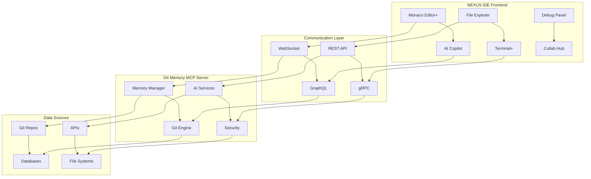

# 🚀 NEXUS IDE Integration Guide

## 📋 Overview

This document provides comprehensive guidance for integrating the Git Memory MCP Server with NEXUS IDE, the next-generation AI-powered development environment.

## 🎯 Integration Architecture



## 🔧 Setup and Configuration

### Prerequisites

- Node.js 18+ or 20+
- Git 2.30+
- NEXUS IDE 2.0+
- Docker (optional, for containerized deployment)

### Installation

```bash
# Clone the repository
git clone https://github.com/your-org/git-memory-mcp-server.git
cd git-memory-mcp-server

# Install dependencies
npm install

# Build the project
npm run build

# Configure NEXUS IDE integration
npm run nexus:sync
```

### Configuration Files

#### 1. NEXUS Integration Config (`nexus-integration.config.json`)

```json
{
  "nexusIDE": {
    "version": "2.0",
    "apiEndpoint": "https://nexus-ide.local/api",
    "websocketEndpoint": "wss://nexus-ide.local/ws",
    "authentication": {
      "type": "bearer",
      "tokenEndpoint": "/auth/token"
    }
  },
  "gitMemoryServer": {
    "host": "localhost",
    "port": 0,
    "protocol": "http",
    "endpoints": {
      "health": "/health",
      "mcp": "/mcp",
      "git": "/git",
      "memory": "/memory"
    }
  },
  "integration": {
    "realTimeSync": true,
    "autoCommit": false,
    "aiAssistance": true,
    "collaborativeEditing": true
  }
}
```

#### 2. Environment Variables

```bash
# .env file
NEXUS_IDE_URL=https://nexus-ide.local
NEXUS_API_KEY=your-api-key-here
GIT_MEMORY_PORT=3000
NODE_ENV=production
LOG_LEVEL=info
```

## 🚀 Deployment Options

### Option 1: Standalone Deployment

```bash
# Start the server
npm run start

# Or with specific port
PORT=3000 npm run start

# For development
npm run dev
```

### Option 2: Docker Deployment

```bash
# Build Docker image
docker build -t git-memory-mcp-server .

# Run container
docker run -p 3000:3000 \
  -e NEXUS_IDE_URL=https://nexus-ide.local \
  -e NEXUS_API_KEY=your-api-key \
  git-memory-mcp-server
```

### Option 3: NEXUS IDE Plugin

```bash
# Deploy as NEXUS IDE plugin
npm run deploy:nexus

# Check deployment status
npm run deploy:status
```

## 🔌 API Integration

### MCP Protocol Endpoints

#### Initialize Connection

```javascript
// POST /mcp
{
  "jsonrpc": "2.0",
  "id": 1,
  "method": "initialize",
  "params": {
    "protocolVersion": "2024-11-05",
    "capabilities": {
      "roots": { "listChanged": true },
      "sampling": {}
    },
    "clientInfo": {
      "name": "NEXUS-IDE",
      "version": "2.0.0"
    }
  }
}
```

#### List Available Tools

```javascript
// POST /mcp
{
  "jsonrpc": "2.0",
  "id": 2,
  "method": "tools/list",
  "params": {}
}
```

#### Execute Tool

```javascript
// POST /mcp
{
  "jsonrpc": "2.0",
  "id": 3,
  "method": "tools/call",
  "params": {
    "name": "git_status",
    "arguments": {
      "path": "/path/to/repo"
    }
  }
}
```

### REST API Endpoints

#### Git Operations

```bash
# Get git status
GET /git/status

# Get git log
GET /git/log?limit=10&branch=main

# Get branches
GET /git/branches

# Create commit
POST /git/commit
{
  "message": "feat: add new feature",
  "files": ["src/file.js"]
}
```

#### Memory Management

```bash
# Get memory status
GET /memory/status

# Search memory
POST /memory/search
{
  "query": "function definition",
  "limit": 10,
  "type": "code"
}

# Add memory entry
POST /memory/add
{
  "type": "code",
  "content": "function example() { return 'hello'; }",
  "metadata": {
    "file": "src/example.js",
    "line": 10
  }
}
```

#### NEXUS IDE Specific

```bash
# Get NEXUS configuration
GET /nexus/config

# Get capabilities
GET /nexus/capabilities

# Get deployment info
GET /nexus/deployment

# Sync with NEXUS IDE
POST /nexus/sync
{
  "type": "full",
  "includeMemory": true,
  "includeGit": true
}
```

### WebSocket Integration

```javascript
// Connect to WebSocket
const ws = new WebSocket('ws://localhost:3000/ws');

// Send ping
ws.send(JSON.stringify({
  type: 'ping',
  timestamp: Date.now()
}));

// Handle messages
ws.on('message', (data) => {
  const message = JSON.parse(data);
  
  switch (message.type) {
    case 'pong':
      console.log('Server responded to ping');
      break;
    case 'git_change':
      console.log('Git repository changed:', message.data);
      break;
    case 'memory_update':
      console.log('Memory updated:', message.data);
      break;
  }
});
```

## 🤖 AI Integration

### AI Copilot Features

```javascript
// Code completion request
POST /ai/complete
{
  "context": {
    "file": "src/example.js",
    "position": { "line": 10, "column": 5 },
    "code": "function example() {\n  // cursor here\n}"
  },
  "options": {
    "maxSuggestions": 5,
    "includeSnippets": true
  }
}

// Code explanation
POST /ai/explain
{
  "code": "const result = array.reduce((acc, item) => acc + item.value, 0);",
  "context": "JavaScript array processing"
}

// Bug detection
POST /ai/analyze
{
  "file": "src/buggy.js",
  "code": "function divide(a, b) { return a / b; }",
  "analysisType": "bugs"
}
```

### Memory-Enhanced AI

```javascript
// Context-aware suggestions
POST /ai/suggest
{
  "query": "How to implement authentication?",
  "context": {
    "project": "web-app",
    "framework": "express",
    "includeMemory": true
  }
}
```

## 🔄 Real-time Collaboration

### Collaborative Editing

```javascript
// Join collaboration session
POST /collab/join
{
  "sessionId": "session-123",
  "userId": "user-456",
  "file": "src/shared.js"
}

// Send edit operation
ws.send(JSON.stringify({
  type: 'edit',
  sessionId: 'session-123',
  operation: {
    type: 'insert',
    position: { line: 5, column: 10 },
    text: 'console.log("hello");'
  }
}));
```

### Presence Awareness

```javascript
// Update user presence
ws.send(JSON.stringify({
  type: 'presence',
  userId: 'user-456',
  cursor: { line: 10, column: 5 },
  selection: {
    start: { line: 10, column: 0 },
    end: { line: 10, column: 20 }
  }
}));
```

## 📊 Monitoring and Analytics

### Health Monitoring

```bash
# Check server health
npm run health:check

# Start monitoring
npm run monitor

# Get monitoring status
npm run monitor:status

# Generate monitoring report
npm run monitor:report
```

### Performance Metrics

```javascript
// Get performance metrics
GET /metrics

// Response:
{
  "server": {
    "uptime": 3600,
    "memory": {
      "used": "45.2 MB",
      "total": "128 MB"
    },
    "cpu": {
      "usage": "12.5%"
    }
  },
  "git": {
    "operations": 150,
    "avgResponseTime": "45ms"
  },
  "memory": {
    "entries": 1250,
    "searchTime": "12ms",
    "hitRate": "89.5%"
  }
}
```

## 🧪 Testing

### Running Tests

```bash
# Run all tests
npm test

# Run integration tests
npm run test:integration

# Run specific test suites
npm run test:integration:basic
npm run test:integration:advanced
npm run test:performance

# Run security tests
npm run test:security
```

### Test Configuration

```javascript
// test.config.js
module.exports = {
  testEnvironment: 'node',
  testTimeout: 60000,
  setupFilesAfterEnv: ['<rootDir>/tests/setup.js'],
  testMatch: [
    '<rootDir>/tests/**/*.test.js'
  ],
  collectCoverageFrom: [
    'src/**/*.js',
    '!src/**/*.test.js'
  ]
};
```

## 🔒 Security

### Authentication

```javascript
// Bearer token authentication
const headers = {
  'Authorization': `Bearer ${nexusApiKey}`,
  'Content-Type': 'application/json'
};
```

### Security Headers

```javascript
// Automatic security headers
{
  'X-Content-Type-Options': 'nosniff',
  'X-Frame-Options': 'DENY',
  'X-XSS-Protection': '1; mode=block',
  'Strict-Transport-Security': 'max-age=31536000'
}
```

### Rate Limiting

```javascript
// Rate limiting configuration
{
  "rateLimit": {
    "windowMs": 900000, // 15 minutes
    "max": 100, // limit each IP to 100 requests per windowMs
    "message": "Too many requests from this IP"
  }
}
```

## 🚨 Troubleshooting

### Common Issues

#### 1. Connection Issues

```bash
# Check server status
curl -f http://localhost:3000/health

# Check NEXUS IDE connectivity
npm run nexus:status

# Restart server
npm run restart
```

#### 2. Memory Issues

```bash
# Check memory status
npm run memory:status

# Reload memory
npm run memory:reload

# Clear memory cache
npm run memory:clear
```

#### 3. Git Issues

```bash
# Check git status
npm run git:status

# Refresh git data
npm run git:refresh

# Reset git state
npm run git:reset
```

### Debug Mode

```bash
# Enable debug logging
DEBUG=* npm run start

# Enable specific debug categories
DEBUG=git:*,memory:* npm run start

# Save debug logs
DEBUG=* npm run start 2>&1 | tee debug.log
```

### Log Analysis

```bash
# View recent logs
tail -f logs/server.log

# Search for errors
grep -i error logs/server.log

# Analyze performance
grep -i "response time" logs/server.log | tail -20
```

## 📈 Performance Optimization

### Memory Optimization

```javascript
// Memory configuration
{
  "memory": {
    "maxEntries": 10000,
    "ttl": 3600000, // 1 hour
    "compression": true,
    "indexing": "full"
  }
}
```

### Caching Strategy

```javascript
// Cache configuration
{
  "cache": {
    "git": {
      "ttl": 300000, // 5 minutes
      "maxSize": "50MB"
    },
    "memory": {
      "ttl": 1800000, // 30 minutes
      "maxSize": "100MB"
    }
  }
}
```

### Database Optimization

```sql
-- Index optimization
CREATE INDEX idx_memory_content ON memory_entries USING GIN(to_tsvector('english', content));
CREATE INDEX idx_git_commits_date ON git_commits(commit_date DESC);
CREATE INDEX idx_files_path ON files USING HASH(file_path);
```

## 🔄 CI/CD Integration

### GitHub Actions

The project includes a comprehensive GitHub Actions workflow (`.github/workflows/nexus-integration.yml`) that:

- Runs pre-flight checks
- Builds and tests the project
- Executes integration tests
- Performs security scans
- Tests NEXUS IDE deployment
- Monitors system health
- Generates comprehensive reports

### Manual Deployment

```bash
# Prepare for deployment
npm run deploy:prepare

# Validate deployment
npm run deploy:validate

# Deploy to NEXUS IDE
npm run deploy:nexus

# Check deployment status
npm run deploy:status
```

## 📚 Additional Resources

### Documentation

- [API Reference](./API-REFERENCE.md)
- [Development Guide](./DEVELOPMENT.md)
- [Deployment Guide](./DEPLOYMENT.md)
- [Security Guide](./SECURITY.md)

### Community

- [GitHub Issues](https://github.com/your-org/git-memory-mcp-server/issues)
- [Discussions](https://github.com/your-org/git-memory-mcp-server/discussions)
- [Discord Server](https://discord.gg/nexus-ide)

### Support

- Email: support@nexus-ide.com
- Documentation: https://docs.nexus-ide.com
- Status Page: https://status.nexus-ide.com

---

## 📄 License

This project is licensed under the MIT License - see the [LICENSE](../LICENSE) file for details.

---

**🚀 Ready to integrate with NEXUS IDE? Follow this guide and you'll be up and running in no time!**