# 🚀 NEXUS IDE - โลโก้เจ๋งๆของเรา

## 📋 ภาพรวม

โลโก้ NEXUS IDE ได้รับการออกแบบมาเพื่อสื่อถึงความทันสมัย ความเชื่อมโยง และพลังของ AI ที่เป็นหัวใจหลักของ IDE ที่ทรงพลังที่สุดในโลก

## 🎨 แนวคิดการออกแบบ

### สัญลักษณ์หลัก
- **วงกลมกลาง**: แสดงถึงแกนหลักของระบบ (Core System)
- **โหนดรอบนอก**: แสดงถึงการเชื่อมต่อกับ AI Providers, MCP Servers, และ Data Sources
- **เส้นเชื่อม**: แสดงถึงการไหลของข้อมูลและการสื่อสารแบบ Real-time
- **อนิเมชั่น**: แสดงถึงความเป็นพลวัตและการทำงานอย่างต่อเนื่อง

### สีสัน
- **Primary Gradient**: `#667eea → #764ba2 → #f093fb`
- **Accent Gradient**: `#4facfe → #00f2fe`
- **สีขาว**: ใช้สำหรับ highlights และ text

## 📁 ไฟล์ที่มีอยู่

```
src/showcase/
├── nexus-logo.svg              # โลโก้หลักในรูปแบบ SVG
├── logo-showcase.html          # หน้าแสดงโลโก้แบบ Interactive
└── NEXUS-LOGO-README.md        # คู่มือนี้
```

## 🎯 การใช้งาน

### 1. โลโก้หลัก (nexus-logo.svg)
- **ขนาด**: 200x200px (สามารถปรับขนาดได้โดยไม่เสียคุณภาพ)
- **รูปแบบ**: SVG Vector Graphics
- **ฟีเจอร์**: มี Animation และ Interactive Effects
- **การใช้งาน**: เหมาะสำหรับเว็บไซต์, แอปพลิเคชัน, และสื่อดิจิทัล

### 2. หน้าแสดงโลโก้ (logo-showcase.html)
- **ฟีเจอร์**: Interactive Showcase
- **เนื้อหา**: 
  - โลโก้หลักพร้อม Animation
  - สถิติของ NEXUS IDE
  - ฟีเจอร์หลักของระบบ
  - Logo Variations
  - Download Links
- **การเปิด**: Double-click หรือเปิดผ่าน Web Browser

## 🎨 Logo Variations

### 1. Simplified Version
- ใช้สำหรับขนาดเล็ก (Favicon, Icons)
- เก็บเฉพาะวงกลมหลักและตัวอักษร "N"

### 2. Monochrome Version
- ใช้สำหรับการพิมพ์ขาวดำ
- สีเดียว (#333333 หรือ #ffffff)

### 3. Icon Only
- ใช้เฉพาะสัญลักษณ์โหนดเชื่อมต่อ
- เหมาะสำหรับ App Icons

## 📐 Brand Guidelines

### ขนาดต่ำสุด
- **Digital**: 32x32px
- **Print**: 1 inch (2.54 cm)

### พื้นที่ว่าง
- รอบโลโก้ควรมีพื้นที่ว่างอย่างน้อย 1/4 ของความกว้างโลโก้

### สีพื้นหลังที่แนะนำ
- **Dark Background**: เหมาะสำหรับโลโก้สีขาว/สี Gradient
- **Light Background**: เหมาะสำหรับโลโก้สีเข้ม
- **Gradient Background**: ใช้ Primary Gradient

### สิ่งที่ไม่ควรทำ
- ❌ ไม่ควรเปลี่ยนสัดส่วนโลโก้
- ❌ ไม่ควรใช้สีที่ไม่ได้กำหนดไว้
- ❌ ไม่ควรวางโลโก้บนพื้นหลังที่มีลวดลายซับซ้อน
- ❌ ไม่ควรหมุนโลโก้ (ยกเว้น Animation)

## 🚀 ความหมายของโลโก้

### ระดับเทคนิค
- **Network Topology**: แสดงถึงสถาปัตยกรรมแบบ Distributed
- **Data Flow**: เส้นเชื่อมแสดงการไหลของข้อมูล
- **Scalability**: โหนดสามารถขยายได้ไม่จำกัด

### ระดับปรัชญา
- **Unity**: ความเป็นหนึ่งเดียวของระบบ
- **Intelligence**: AI ที่เชื่อมต่อทุกอย่าง
- **Innovation**: ความก้าวหน้าทางเทคโนโลジี
- **Collaboration**: การทำงานร่วมกันแบบ Seamless

## 📊 สถิติที่โลโก้แสดงถึง

- **1000+ MCP Servers**: ความสามารถในการเชื่อมต่อ
- **34+ AI Models**: ความหลากหลายของ AI
- **99.97% Uptime**: ความเสถียรของระบบ
- **300% Faster**: ประสิทธิภาพที่เหนือกว่า

## 🎯 การใช้งานในบริบทต่างๆ

### เว็บไซต์และแอปพลิเคชัน
```html
<!-- สำหรับ HTML -->


<!-- สำหรับ Favicon -->
<link rel="icon" type="image/svg+xml" href="nexus-logo.svg">
```

### การพิมพ์
- **Business Cards**: ใช้ Simplified Version
- **Letterhead**: ใช้ Full Logo
- **Merchandise**: ใช้ Icon Only หรือ Monochrome

### Social Media
- **Profile Picture**: Icon Only (Square Format)
- **Cover Photo**: Full Logo with Text
- **Posts**: Logo Variations ตามเนื้อหา

## 🔄 การอัปเดตและการพัฒนา

### Version History
- **v1.0**: โลโก้เริ่มต้นพร้อม Animation
- **v1.1**: เพิ่ม Logo Variations
- **v1.2**: ปรับปรุง Color Palette

### แผนการพัฒนาต่อไป
- [ ] สร้าง 3D Version
- [ ] เพิ่ม Dark Mode Variant
- [ ] สร้าง Animated GIF Version
- [ ] พัฒนา Brand Mascot

## 📞 ติดต่อ

หากมีคำถามเกี่ยวกับการใช้งานโลโก้หรือต้องการไฟล์เพิ่มเติม กรุณาติดต่อทีมพัฒนา NEXUS IDE

---

**NEXUS IDE** - The Most Powerful IDE Ever Created 🚀

*"เชื่อมต่อทุกสิ่ง พัฒนาทุกความเป็นไปได้"*